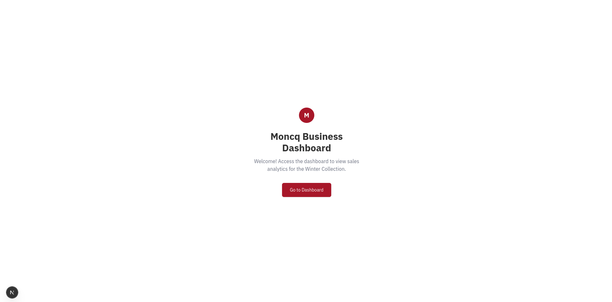
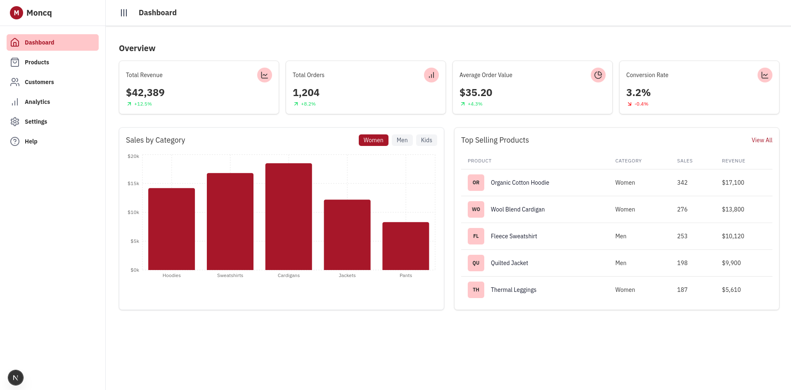

# Moncq Business Dashboard Assessment

## Project Overview

This project is a frontend developer assessment task to build a responsive business dashboard for Moncq, a mock clothing company. The dashboard focuses on tracking sales and performance metrics for their Winter (Hiemals) Collection.

The primary goal is to showcase skills in frontend development with modern tools, data visualization, and responsiveness.

## Technology Stack

- Framework: Next.js (App Router)
- Language: TypeScript
- UI Library: React
- Styling: Tailwind CSS
- UI Components: Shadcn UI
- Charting: Recharts
- Icons: Lucide React
- Data: Mock data

## Setup and Running

1.  Clone the repository or download the project files.
2.  Navigate to the project's root directory in your terminal.
3.  Install dependencies:
    ``npm install``
    (or ``yarn install`` / ``pnpm install``)
4.  Run the development server:
    ``npm run dev``
    (or ``yarn dev`` / ``pnpm dev``)
5.  Open your browser and navigate to ``http://localhost:3000``.

## Screenshots

